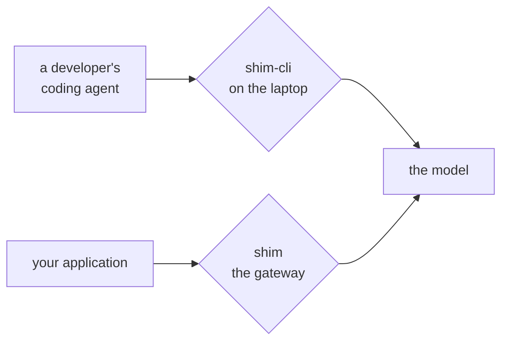

<p align="center">
  <picture>
    <source media="(prefers-color-scheme: dark)" srcset="https://raw.githubusercontent.com/GetSHIM/.github/main/profile/assets/shim-wordmark-dark.png">
    
  </picture>
</p>

<p align="center">
  <em>The biggest fish trust the smallest cleaner.</em>
</p>

<p align="center">
  <a href="https://getshim.tech">getshim.tech</a>
  &nbsp;·&nbsp;
  <a href="https://www.linkedin.com/company/getshim">LinkedIn</a>
</p>

---

Cleaner shrimp keep stations on the reef. Big fish swim up on their own, hold
still, and let the shrimp pick the parasites off. The station is small, quick,
and nobody makes a fuss about it.

We build the same thing for text on its way to an AI provider: something small
in the path that takes the personal data out before it leaves.

Two of those pieces are open source. They sit at different points in the path.



## shim

The gateway. It sits between your application and OpenAI, Anthropic or Gemini,
and applies privacy, quota, spend and admission policy to every request. It does
not translate your payload into a
shared format, so a provider's new field or model works the day it ships.

Self-hosted, Python 3.13, and the community gateway needs no database. Install
and configuration are in the repository.

Apache-2.0, with the enterprise composition under `ee/` source-available under
the Elastic License 2.0. The boundary is written down in the repository rather
than discovered later.

**[GetSHIM/shim](https://github.com/GetSHIM/shim)**

## shim-cli

The same idea one step earlier, on a developer's own laptop. Two commands,
two different questions:

| Command | Answers |
| --- | --- |
| `shim watch -- claude` | What did this session actually send, and what did it cost? |
| `shim install claude` | Mask secrets and personal data in eligible tool results, every session. |

`shim watch` runs a loopback proxy for the length of one command and changes
nothing on the way through. It reports where the input tokens went and which
sensitive values were in them. Claude Code only for now.

The hook replaces detected values with typed placeholders like `<EMAIL_1>`:
email addresses, phone numbers, credit cards, IBANs, IP and MAC addresses, US
SSNs, Turkish national and tax IDs, secrets, and database URIs. The hook and the
detector run locally with no account, API key, daemon, telemetry or prompt
history. `shim watch` forwards only to the provider your client already uses.

```console
uv tool install --python 3.12 --compile-bytecode shim
shim install claude      # or codex, or copilot
shim watch -- claude
```

| Client | Your typed prompt | Tool input and results |
| --- | --- | --- |
| Claude Code | Reported and let through; blocked under `enforce` | Eligible arguments and results masked |
| Codex CLI | Reported and let through; blocked under `enforce` | Not covered yet |
| GitHub Copilot CLI | Model-facing prompt replaced with the redacted text | Not covered yet |

> [!WARNING]
> A best-effort guard, not a data-loss prevention boundary. Your client reads
> the raw prompt before the hook runs, detection can miss things, and a crashed
> or timed-out hook may fail open depending on the client. The limits are
> written down, so [read them](https://github.com/GetSHIM/shim-cli/blob/main/docs/privacy.md)
> before pointing this at anything sensitive.

**[GetSHIM/shim-cli](https://github.com/GetSHIM/shim-cli)** &nbsp;·&nbsp; [PyPI](https://pypi.org/project/shim/) &nbsp;·&nbsp; Apache-2.0

<details>
<summary>What is not here</summary>

<br>

The dashboard, the stored evidence, the roles and the budgets are not open and
are not planned to be. We would rather say that once, here, than leave a roadmap
page implying otherwise. When something opens, it opens in this organization.

</details>

---

<sub>Istanbul · <a href="https://getshim.tech">getshim.tech</a> · Security reports: private advisory on <a href="https://github.com/GetSHIM/shim/security/advisories/new">shim</a> or <a href="https://github.com/GetSHIM/shim-cli/security/advisories/new">shim-cli</a></sub>
