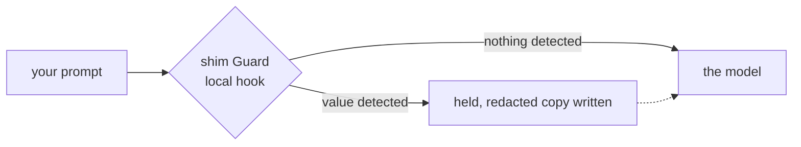

<p align="center">
  <picture>
    <source media="(prefers-color-scheme: dark)" srcset="https://raw.githubusercontent.com/GetSHIM/.github/main/profile/assets/shim-wordmark-dark.png">
    
  </picture>
</p>

<p align="center">
  <em>The biggest fish trust the smallest cleaner.</em>
</p>

<p align="center">
  <a href="https://getshim.tech">getshim.tech</a>
  &nbsp;·&nbsp;
  <a href="https://www.linkedin.com/company/getshim">LinkedIn</a>
</p>

---

Cleaner shrimp keep stations on the reef. Big fish swim up on their own, hold
still, and let the shrimp pick the parasites off. The station is small, quick,
and nobody makes a fuss about it.

We build the same thing for text on its way to an AI provider: something small
in the path that takes the personal data out before it leaves.

One piece of that is open source. This is it.

## shim Guard

A pre-submit hook for coding agents. It reads the prompt on your machine and
replaces detected values with typed placeholders like `<EMAIL_1>` — email
addresses, phone numbers, credit cards, IBANs, IP and MAC addresses, US SSNs,
Turkish national and tax IDs, secrets, and database URIs.

No account, no API key, no network call, no daemon, no telemetry, no prompt
history. Nothing to sign up for.

```console
uv tool install --compile-bytecode shim-guard
shim install claude    # or codex, or copilot
```



| Client | What happens when a value is detected |
| --- | --- |
| Codex CLI | Submission blocked, private redacted file written to resubmit |
| Claude Code | Submission blocked, private redacted file written to resubmit |
| GitHub Copilot CLI | Model-facing prompt replaced with the redacted text |

> [!WARNING]
> Alpha, and a best-effort guard rather than a data-loss prevention boundary.
> Your client reads the raw prompt before our hook runs, detection can miss
> things, and a crashed or timed-out hook may fail open depending on the client.
> The limits are written down — [read them](https://github.com/GetSHIM/shim-guard/blob/main/docs/privacy.md)
> before pointing this at anything sensitive.

**[GetSHIM/shim-guard](https://github.com/GetSHIM/shim-guard)** &nbsp;·&nbsp; [PyPI](https://pypi.org/project/shim-guard/) &nbsp;·&nbsp; Apache-2.0

<details>
<summary>Why there is only one repository here</summary>

<br>

We build more than this, and the rest is not open yet — so there is nothing to
link. An empty org page beats a roadmap page. When something opens, it opens
here.

</details>

---

<sub>Istanbul · <a href="https://getshim.tech">getshim.tech</a> · Security reports: <a href="https://github.com/GetSHIM/shim-guard/security/advisories/new">private advisory</a></sub>
